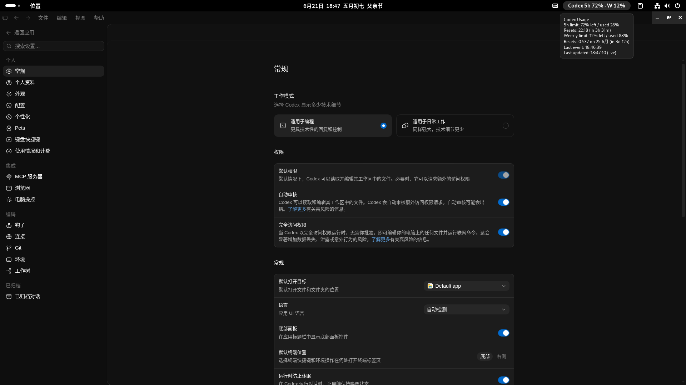
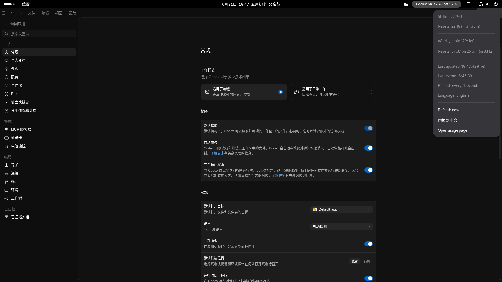

# Codex Usage GNOME Shell Extension

Show local Codex usage in the GNOME Shell top bar.

The extension calls Codex's local app-server protocol
(`account/rateLimits/read`) to read current account limits, then shows remaining
5-hour and weekly quota in the panel. If the app-server call fails, it falls
back to the latest local `rate_limits` event under `~/.codex/sessions`.

The panel refreshes every 1 second. Because the app-server request can take a
few seconds, the extension skips overlapping refreshes and updates as soon as
the current request returns.

The panel text defaults to Chinese:

```text
Codex 5时 90% · 周 20%
```

Use the menu item `切换到 English` / `切换到中文` to switch display language. The
choice is saved in:

```text
~/.config/codex-usage/preferences.json
```
## Instructions

You are required to complete the installation of Codex Desktop for Linux as a prerequisite step.
Project repository link: https://github.com/ilysenko/codex-desktop-linux

## Local Install

```bash
./install.sh
gnome-extensions enable codex-usage@local
```

If GNOME does not load the extension immediately, log out and back in, or press
`Alt+F2`, enter `r`, and press Enter on an X11 session. On Wayland, logging out
and back in is the reliable reload path.

On Wayland, a newly installed extension may not appear in `gnome-extensions
list` until the next login because the running Shell process has not rescanned
the extensions directory yet.

When changing `extension.js`, `gnome-extensions disable/enable` may keep using
GNOME Shell's cached module. If `gnome-extensions info codex-usage@local` shows
an old version after install, log out and back in to force a clean reload.

## Manual Package

For sharing with another GNOME machine, zip the extension directory contents:

```bash
cd gnome-shell/codex-usage@local
zip -r ../../codex-usage@local.shell-extension.zip .
```

## Status Script

```bash
./scripts/codex-usage-status --json
./scripts/codex-usage-status
./scripts/codex-usage-status --lang en
./scripts/codex-usage-status --source api
./scripts/codex-usage-status --source local
```

The script caches the last good result in:

```text
~/.cache/codex-usage/status.json
```

## Repository Layout

```text
gnome-shell/codex-usage@local/  GNOME Shell extension
scripts/codex-usage-status      Local Codex usage parser
install.sh                      Local installer
```

## Screenshot




